# Website Health Monitor 🔍

A GitHub Actions-powered monitoring system that checks your websites hourly and alerts you via Telegram if any go down. Includes SSL expiry tracking, uptime statistics, and interactive status reports.


## Features ✨
- **Hourly website checks** (HTTP status, latency)
- **Instant Telegram alerts** when sites go down
- **SSL certificate expiry** monitoring
- **Uptime percentage** tracking
- **Interactive Telegram buttons** for real-time status
- **Auto-committed status history** in `status.json`
- **Optional public status page** (GitHub Pages)

## Setup Guide 🛠️

### 1. Prerequisites
- GitHub account
- Telegram account (for alerts)
- Websites to monitor (HTTP/HTTPS)

### 2. Repository Setup
1. Fork or create this repository
2. Add the following secrets in `Settings → Secrets → Actions`:
   - `TELEGRAM_TOKEN`: Obtain from [@BotFather](https://t.me/BotFather)
   - `CHAT_ID`: Get via [@getidsbot](https://t.me/getidsbot)
   - `WEBSITES`: JSON array of websites (see format below)

### 3. Website Configuration
Configure the `WEBSITES` secret in the following JSON format:
```json
[
  {
    "name": "Example",
    "url": "https://example.com",
    "validation_text": "Welcome",  // Optional content check
    "ssl_warning_days": 30         // Days before SSL expiry to warn
  }
]
```
**Pro Tip**: Minify JSON for GitHub Secrets using `jq -c . < websites.json`.

## Usage 📡

### Monitoring Behavior
- **Normal operation**: No alerts (all sites are up).
- **Site down**:
  ```
  ⚠️ [Example] is DOWN
  URL: https://example.com
  Error: Connection timed out
  Last Online: 2023-08-20 12:00:00
  ```
- **Site recovered**:
  ```
  ✅ [Example] is BACK UP
  URL: https://example.com
  Response Time: 142ms
  ```

### Telegram Commands
- Click **"Full Status"** for current status.
- Click **"SSL Info"** for certificate details.

## Customization ⚙️

### Adjust Check Frequency
Edit `.github/workflows/checker.yml` to change the schedule:
```yaml
schedule:
  - cron: '0 * * * *'  # Every hour at :00
  # Examples:
  # '*/15 * * * *'    - Every 15 minutes
  # '0 0 * * *'       - Daily at midnight
```

### Add More Checks
Modify `checker.py` to:
- Verify response body content
- Check API endpoints
- Monitor specific ports

## Status Page (Optional) 🌐
1. Enable GitHub Pages in `Settings → Pages`.
2. Select branch: `main` and folder: `/docs`.
3. Access at: `https://<username>.github.io/<repo>`.

## Troubleshooting 🔧
| Error | Solution |
|-------|----------|
| 403 Permission denied | Add `contents: write` permissions in workflow |
| SSL verification failed | Set `"ssl_warning_days": null` in website config |
| No Telegram alerts | Verify `CHAT_ID` includes `-` for groups |

## Example Alert Flow

```mermaid
sequenceDiagram
  participant G as GitHub Actions
  participant W as Website
  participant T as Telegram
  G->>W: Check status
  W-->>G: Down (timeout)
  G->>T: ⚠️ Site DOWN alert
  G->>W: Check again
  W-->>G: Up (200 OK)
  G->>T: ✅ Site UP alert
```


## License
This project is released under the [Unlicense](LICENSE).

## Contributing
Contributions are welcome! Please submit a pull request or open an issue for suggestions.

## Contact
For support, reach out via [GitHub Issues](https://github.com/your-username/your-repo/issues).
